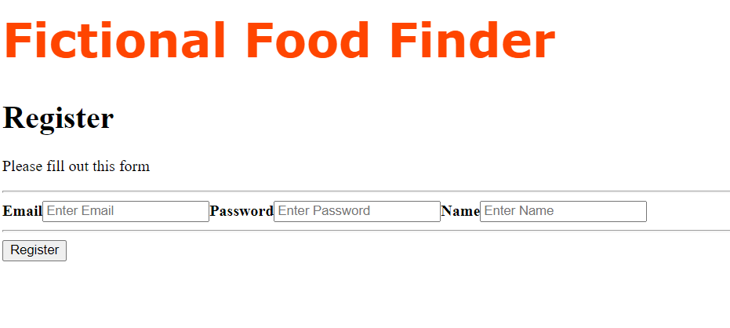
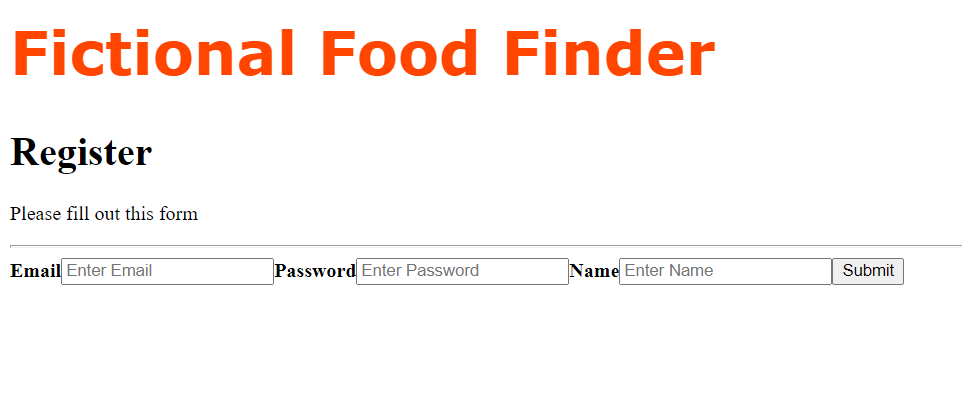
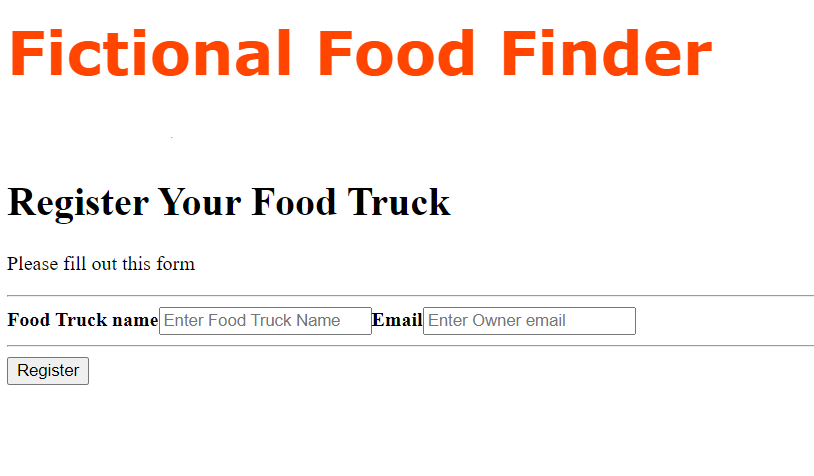
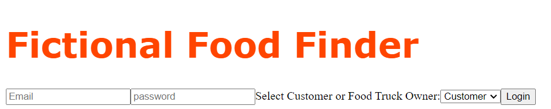
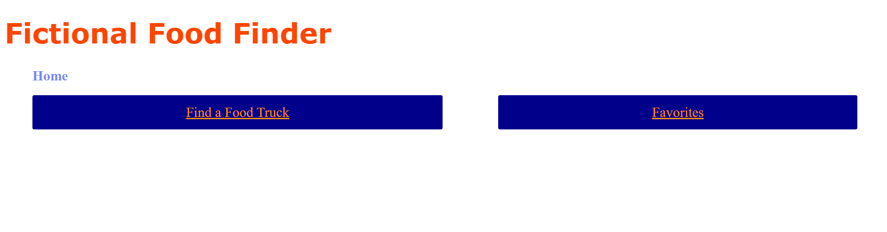
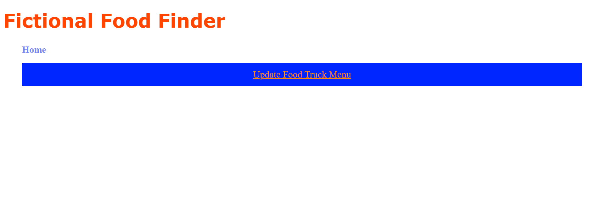
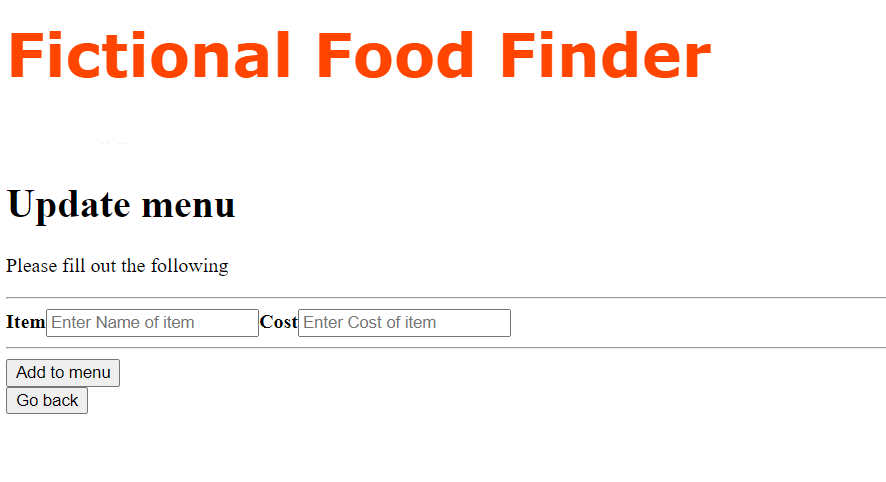
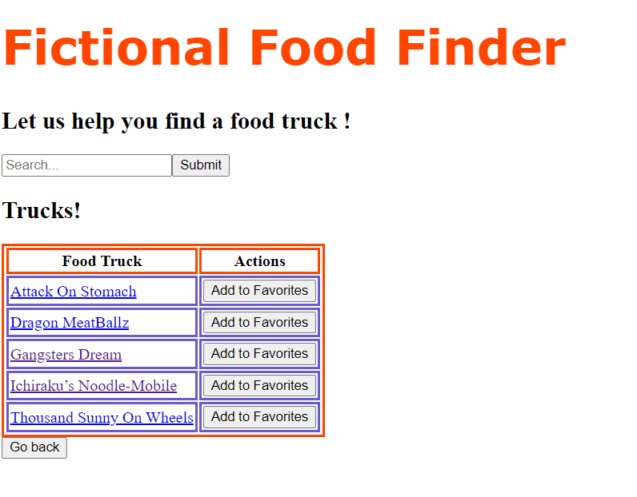
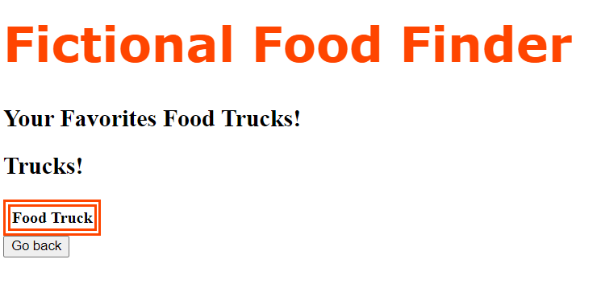

# Fictional Food Finder

## Project Description

The Fictional Food Finder allows users to be able to sign up or sign in to view nearby food trucks that are in their city. They can also take their location or a given location and find the closest truck nearby. Business owners for trucks will also be able to create or log in to edit their own profile and menu. Business owners will also be able to update their current menu, social media, business information, and location.

## Technologies Used

* Java
* Spring Boot
* Angular
* Jenkins
* Hibernate
* TypeScript
* EC2
* DevOps
* Agile-Scrum
* JUnit
* SQL
* GIT

## Features

* Log in system for owners and customers
* Sign up to create an account under customer, or as a food truck owner.
* Displays all trucks for user to see.

To-Do List:

* Finish Implementing the front end UI for Owner and Customer
* Finish the implementation to make a working favorites button
* Implement Google Maps API to show the user their location and to find the nearest location.

## Getting Started

First off, there are two repositories you will need to clone.  These are the two commands for cloning both repos.

The second repo can be accessed at this link: https://github.com/JwA-Digital-Stars/Frontend-Fictional-Food-Finder

git clone https://github.com/JwA-Digital-Stars/Fictional-Food-Finder.git

git clone https://github.com/JwA-Digital-Stars/Frontend-Fictional-Food-Finder

After that, you will need to have an EC2 set up on AWS as well as a S3 Bucket. Once you have those, make sure Java 8, and Jenkins is installed on that EC2.

## Usage

Register as a Customer.

Register as a Food Truck Owner.

Register your food truck.

This is the login page for the application.

If logged in as a customer this is the customer dashboard.

If logged in as a customer this is the owner dashboard.

The owner can update his food truck menu with the following form. 

As a cutomer you are given a list of all the available trucks. There is an option to add trucks to favorites.

The list displayed of the customers favorites.

## Contributors
* Alex Junker
* Patrick Downton
* Jose Gomez
